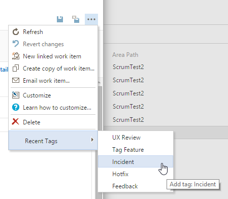
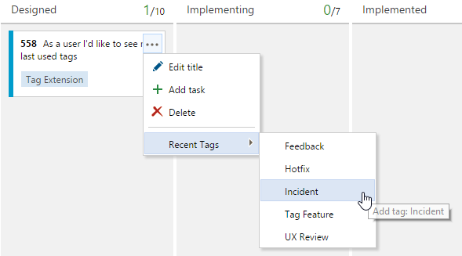
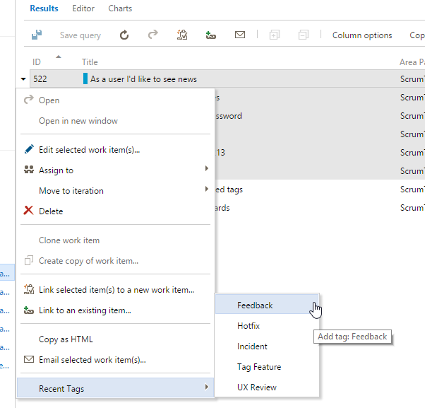

## Quickly add your most recently used tags to any work item

This simple extension:
* Keeps track of your 5 most recently added tags
* Allows to add recent tags from 
 * Backlog
 * Taskboard
 * Kanban Board
 * Query Result
 * Work Item Form 
 
## Work Item Form
 
Tags show up in every work item form menu:

## Backlog

You can add tags from product or iteration backlog:

## Board
Kanban as well as Taskboard support it, too:

## Query Result

In views that support multi-selection (backlogs, query results) you can also add tags to multiple work items at once: 

## Open Source

The full source is available at https://github.com/cschleiden/vsts-extension-tags-mru.